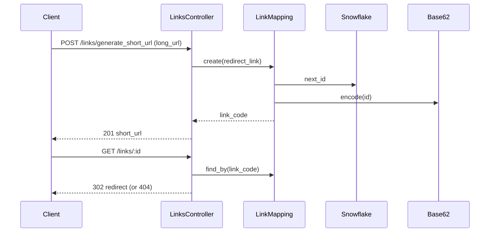

# Case study: URL shortener

Short links: create a mapping from a long URL to a compact code, then redirect on visit.

_End-to-end write-up for the short-link experiment. Service-specific details live in linked `notes/` files._

## Main Problem

Accept a long URL, store a unique short code, redirect visitors to the original URL when they hit the short link.

## Underlying Problems:
- How is the unique short code generated?
- How is the data stored? What are you storing? 
- What status code should you use for the redirect?
- How do you handle high read requests?

## Design Notes
1. Each long URL should have its own distinct URL. Regardless if the long URLs are duplicated.
2. This is just a redirect 

## Limitation
- The short URLs are just used for redirects. Nothing is generated based on the URL.
- This is deterministic and stateless. No personalization, no per-user variation/

## Additionals
- Analytics can be added - visits in the short URL
- Rate limit if link is private or with auth
- DB replicas for high read traffic
- Caching high traffic URLs using LRU (Least Recently Used) eviction, rather than TTL (Time to Live)

## Possible solutions
1. Considering a high traffic request, what is the most optimal way to generate the code with less check in the databse if code already exists. Or we use the database autoincrement, encode it with Base62 and give that to user, but quite predictable, considering the app doesn't have auth. Any user can guess a succeeding number, encode it, and they'll be redirect to other's URL. Also, depending on database autoincrement, can't scale infinitely considering you have like 50+ servers running.
2. Though of using UUIDs, but it kind of defeats the purpose of "short" URL.
3. We can use Snowflake Algorithm, suggested by Claude.
4. We can also use a range block allocation.

In the range block allocation, we need a central coordinator endpoint to assign different allocations in different servers.
For example, Server A is assigned 1_000_000 to 2_000_000. Server B is assigned 2_000_001 to 3_000_000. Each server is responsible for maintaining its own pool. But what will happen when a server goes down or restarts? The assigned block is gone forever. Since it will request a new set of IDs. This is quite difficult especially when deploys are done every now and them.

In the controller, I'd go with using 302 stats code rather than 301. This is because, 301, which moved permanently already stores this in the browser cache and it doesn't hit the controller anymore, which meant analytics can't be checked anymore.

## Flow



## Database Design
[Add design design here.]

Added unique index to link_code in order to make search faster when querying for the redirect URL.


## API

| Method | Path | Purpose |
|--------|------|---------|
| `POST` | `/links/generate_short_url` | Param `long_url` → JSON `{ "short_url": "..." }` |
| `GET` | `/links/:id` | Temporary redirect (`302`) to stored URL, or `404` |

## Files (this experiment)

| Layer | File | Role |
|-------|------|------|
| Routes | [`config/routes.rb`](../config/routes.rb) | `resources :links`, collection `generate_short_url` |
| Controller | [`app/controllers/links_controller.rb`](../app/controllers/links_controller.rb) | Create mapping, redirect on show |
| Model | [`app/models/link_mapping.rb`](../app/models/link_mapping.rb) | Validation, snowflake + Base62 on create |
| Snowflake | [`app/services/snowflake/generator_service.rb`](../app/services/snowflake/generator_service.rb) | Unique numeric id |
| Base62 | [`app/services/utils/base62_service.rb`](../app/services/utils/base62_service.rb) | Compact URL-safe `link_code` |
| Schema | [`db/schema.rb`](../db/schema.rb) | `link_mappings` table |

## Tests

| Spec | Covers |
|------|--------|
| [`spec/requests/links_spec.rb`](../spec/requests/links_spec.rb) | HTTP API |
| [`spec/models/link_mapping_spec.rb`](../spec/models/link_mapping_spec.rb) | Model + code generation |
| [`spec/services/utils/base62_service_spec.rb`](../spec/services/utils/base62_service_spec.rb) | Slug encoding (utility) |

```bash
bundle exec rspec spec/requests/links_spec.rb spec/models/link_mapping_spec.rb spec/services/utils/base62_service_spec.rb
```

## Related notes (single-topic)

| Topic | Location |
|-------|----------|
| Base62 alphabet, encode/decode, gotchas | [`app/services/utils/notes/base62.md`](../app/services/utils/notes/base62.md) |
| Snowflake layout, epoch, concurrency | _add [`app/services/snowflake/notes/`](../app/services/snowflake/) when ready_ |

## Design notes

_Add your own sections here: why snowflake vs UUID, redirect status 302 vs 301, collision handling, scaling, things you tried, bugs found, etc._

## Follow-ups

- [ ] Document Snowflake in `app/services/snowflake/notes/`
- [ ] _…_
