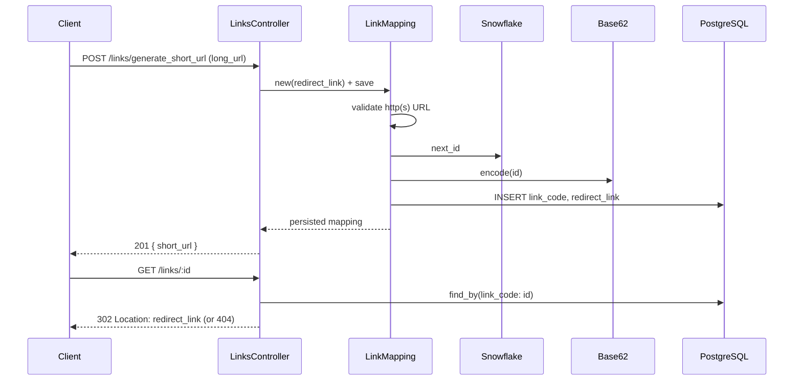

# Case study: URL shortener

Short links: create a mapping from a long URL to a compact code, then redirect on visit.

_End-to-end write-up for the short-link experiment. Algorithm deep dives live in linked `notes/` files (Base62, Snowflake)._

## Main problem

Accept a long URL, persist a **unique** short code, and redirect visitors to the stored destination when they request `GET /links/:code`.

## Underlying problems

- **Code generation:** How do we produce a unique `link_code` without a hot “does this slug exist?” loop on every create?
- **Persistence:** What do we store (long URL only vs metadata)? How do we index for fast lookup on read-heavy traffic?
- **Redirect semantics:** Which HTTP status should the redirect use so browsers and intermediaries behave predictably (especially if analytics are added later)?
- **Read scale:** Redirect path is read-heavy; how might caching, replicas, or rate limits fit in later?

## Design notes

1. **One row per create:** Each submitted long URL gets its **own** short link, even if another row already points at the same `redirect_link`. There is no deduplication—by design, so every share gets a distinct slug and (future) visit stats.
2. **Redirect-only product surface:** The short URL does not render content; it only resolves `link_code → redirect_link` and issues an HTTP redirect. No HTML, no personalization in the current scope.

## Collision retry logic

`LinkMapping` generation attempts `INSERT` directly rather than checking existence first (check-then-insert has the race condition above). On a real collision:

- Rescue **`ActiveRecord::RecordNotUnique`** specifically — not a broad `rescue => e` — so unrelated failures (DB connection issues, validation errors) aren't silently retried and masked.
- Use Ruby's `retry` keyword to jump back to the top of the `begin` block, generating a **fresh** id each attempt (not re-inserting the same colliding one).
- Cap retries at a small bounded number (5) — collision probability is low given the id space, so this bounds worst-case latency without needing to be large.

**Known gap:** the retry loop runs synchronously inside the request. An attempt-count cap bounds *tries*, not *time* — if the DB is slow/struggling, 5 retries could still add meaningful latency. Worth load-testing before deciding if retries need their own time budget in addition to the attempt cap.

## Limitations (current scope)

- Short URLs are **only** redirects. Nothing is generated or rendered from the slug beyond the lookup.
- Behavior is **deterministic and stateless** at the edge: no auth, no per-user variation, no A/B logic.
- **`LinkMapping` creates a new `Snowflake::GeneratorService` per record** today. Sequence state is per generator instance, not process-wide. Under concurrent creates in the same millisecond, rely on the **unique index on `link_code`** (and consider a shared generator singleton for production hardening).

## Future additions (not implemented)

- **Analytics:** Log or store visits per `link_code` (requires redirects to hit the app—see [302 vs 301](#redirect-302-found-vs-301-moved-permanently) below).
- **Rate limiting** for create and/or redirect when links are private or authenticated.
- **Read replicas** for PostgreSQL if redirect lookups dominate.
- **Hot-path cache** for high-traffic slugs (e.g. in-memory LRU by `link_code` rather than TTL-only eviction, so popular links stay warm).
- **Read replica lag:** if replicas are added, a link created and immediately visited before replication catches up could 404 on the replica. Minor in practice, but worth naming as a tradeoff.

## ID generation: options considered

### 1. Random code + collision check

Generate a random string (e.g. 7 chars from `[a-zA-Z0-9]`), check if it exists, retry on collision.

- **Pros:** Simplest to reason about; no bit-packing or coordination needed.
- **Cons:** Collision probability rises as the table fills; naive "check-then-insert" has a **race condition** under concurrent writers (two requests can both check, both see "free," both insert). Fix is to let the DB's unique constraint catch it via insert-then-rescue, not check-then-insert — see collision retry section below.

### 2. Database auto-increment + Base62

Use the DB serial, encode with Base62, use that as `link_code`.

- **Pros:** Simple; no separate id service; uniqueness is natural.
- **Cons:** **Predictable** slugs—without auth, anyone can increment/guess encoded ids and hit others’ destinations. **Hard to scale writes** across many app nodes if the DB is the single sequence source. Extra **existence checks** are unnecessary if the sequence is authoritative, but the predictability and DB coupling remain.

### 3. UUIDs

- **Pros:** Opaque, distributed-friendly.
- **Cons:** Long strings (even hex/ Base62 UUIDs)—works against “short” URLs.

### 4. Snowflake-style ids (chosen)

64-bit (integer) ids: timestamp + machine + sequence bit fields; encode with Base62 for the path segment.

- **Pros:** Sortable-ish by time, no DB round-trip to “reserve” an id, compact slug after Base62, low collision rate when the generator is used correctly.
- **Cons:** Requires correct **machine id** and **single generator lifecycle** per process (or per pod) in production; custom epoch and bit layout must stay stable once deployed.

Implemented in [`app/services/snowflake/generator_service.rb`](../app/services/snowflake/generator_service.rb); slug encoding in [`app/services/utils/base62_service.rb`](../app/services/utils/base62_service.rb). On create, [`LinkMapping`](../app/models/link_mapping.rb) runs `encode(Snowflake::GeneratorService.new.next_id)`.

### 5. Range / block allocation

A central coordinator assigns each server a numeric range (e.g. Server A: `1_000_000..2_000_000`, Server B: `2_000_001..3_000_000`). Each node allocates from its local pool without hitting the DB for every id.

- **Pros:** Very fast creates at scale; predictable load on coordinator.
- **Cons:** **Coordinator dependency**; **lost ranges** if a node dies or redeploys and discards its block—gaps are acceptable for urls but the ops story is harder, especially with **frequent deploys** when a server restarts and requests a new block while the old block is unused.

**Why Snowflake for this repo:** Good balance of short codes, no central allocator in the experiment, and no guessable sequential slugs—without accepting UUID length.

## Redirect: `302 Found` vs `301 Moved Permanently`

In [`LinksController#show`](../app/controllers/links_controller.rb) the app uses **`302 Found`** (`status: :found`), not `301`.

| Status | Typical client behavior | Impact on this app |
|--------|-------------------------|-------------------|
| **301** | Browsers and some caches **store** the redirect target; later visits may **skip your server** and go straight to the long URL. | **Analytics and visit counts** on the short link stop seeing traffic; changing the destination later is harder for cached clients. |
| **302** | Treated as **temporary**; clients usually re-request the short URL. | Each click can hit the controller again—better if you add **analytics**, revoke links, or change targets. |

External hosts are allowed via `allow_other_host: true` because destinations are user-supplied `http`/`https` URLs validated on create.

## Flow



## Database design

Table: **`link_mappings`**

| Column | Type | Notes |
|--------|------|--------|
| `link_code` | `string`, NOT NULL | Public slug (Base62 snowflake id); lookup key for redirects |
| `redirect_link` | `string`, NOT NULL | Full `http`/`https` URL |
| `created_at` / `updated_at` | `datetime` | Standard Rails timestamps |

**Indexes**

- **Unique index on `link_code`** (`index_link_mappings_on_link_code`): enforces uniqueness at the DB layer and supports fast `find_by(link_code: …)` on the redirect path (O(log n) btree lookup vs full scan).

We do **not** store the raw snowflake integer separately; only the encoded slug. Reversing the id is possible via Base62 decode if ever needed for debugging.

**Not stored (yet):** visit counts, owner user id, expiry, soft delete flags.

## API

| Method | Path | Request | Success | Error |
|--------|------|---------|---------|-------|
| `POST` | `/links/generate_short_url` | Param **`long_url`** (form/query/body param) | **201** JSON `{ "short_url": "<app url>/links/<code>" }` | **422** `{ "error": [ "..."] }` validation messages |
| `GET` | `/links/:id` | `:id` = `link_code` | **302** `Location: redirect_link` | **404** empty body if unknown code |

Rails routes: `resources :links, only: [:show]` plus collection route `post :generate_short_url`.

## Validation and security

On create, `redirect_link` must be present and parse as **`URI::HTTP` / `URI::HTTPS`** with a non-empty **host** (see `long_url_must_be_valid` on [`LinkMapping`](../app/models/link_mapping.rb)). Malformed URIs and non-http(s) schemes are rejected before insert.

Brakeman may flag **open redirects** on `redirect_to` with `allow_other_host: true`; that is intentional for a shortener, gated by the validation above. See `config/brakeman.ignore` if documented for CI.

## Files (this experiment)

| Layer | File | Role |
|-------|------|------|
| Routes | [`config/routes.rb`](../config/routes.rb) | `resources :links`, collection `generate_short_url` |
| Controller | [`app/controllers/links_controller.rb`](../app/controllers/links_controller.rb) | Create mapping, 302 redirect on show |
| Model | [`app/models/link_mapping.rb`](../app/models/link_mapping.rb) | URL validation, snowflake + Base62 on create |
| Snowflake | [`app/services/snowflake/generator_service.rb`](../app/services/snowflake/generator_service.rb) | Time-ordered 64-bit ids (in-process mutex) |
| Base62 | [`app/services/utils/base62_service.rb`](../app/services/utils/base62_service.rb) | Compact URL-safe `link_code` |
| Schema | [`db/schema.rb`](../db/schema.rb) | `link_mappings` + unique index |

## Tests

| Spec | Covers |
|------|--------|
| [`spec/requests/links_spec.rb`](../spec/requests/links_spec.rb) | HTTP API (create + redirect + 404) |
| [`spec/models/link_mapping_spec.rb`](../spec/models/link_mapping_spec.rb) | Validations + `link_code` generation (snowflake stubbed) |
| [`spec/services/utils/base62_service_spec.rb`](../spec/services/utils/base62_service_spec.rb) | Slug encode/decode |
| [`spec/services/snowflake/generator_service_spec.rb`](../spec/services/snowflake/generator_service_spec.rb) | Id layout, sequence, concurrency |

```bash
bundle exec rspec spec/requests/links_spec.rb \
  spec/models/link_mapping_spec.rb \
  spec/services/utils/base62_service_spec.rb \
  spec/services/snowflake/generator_service_spec.rb
```

## Related notes (single-topic)

| Topic | Location |
|-------|----------|
| Base62 alphabet, encode/decode, gotchas | [`app/services/utils/notes/base62.md`](../app/services/utils/notes/base62.md) |
| Snowflake layout, epoch, concurrency | [`app/services/snowflake/README.md`](../app/services/snowflake/README.md) and/or future `app/services/snowflake/notes/` |

## Follow-ups

- [ ] Document Snowflake bit layout in `app/services/snowflake/notes/`
- [ ] Shared/process-level `GeneratorService` (avoid per-record `new`)
- [ ] Wire `machine_id` from hostname/pod ordinal in Kubernetes
- [ ] Analytics table + redirect logging
- [ ] Cache layer for hot `link_code` lookups
